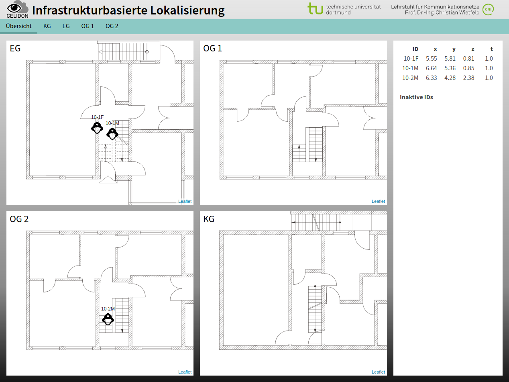

# Installation
Install [docker](https://docs.docker.com/install/) and [docker-compose](https://docs.docker.com/compose/install/) on your system and download this repository.


# Configuration
A mapping of localization IDs and Names can be configured in `position_server/config.py`.


# Run
Run `docker-compose up` in the main folder of this repository to start the web ui.
The Visualization is acessible at `http://<ip-of-this-machine>:80` or [http://localhost:80](http://localhost:80). For the production build a MQTT broker running at this machine listening to port 1883 is required. If no MQTT broker is available you can run a MQTT broker with `docker run -ti -p 1883:1883 toke/mosquitto`.


# Development
A development build of the web ui where changes in the frontend are directly applied can be started by `docker-compose -f docker-compose-dev.yml up --build`.
The Visualization is acessible at [http://localhost:80](http://localhost:80). For the development build no MQTT broker is needed, as it is already included.


# API
The position server listens to multiple MQTT topics.
The message format uses JSON and is defined as follows.
Unless otherwise specified all transmitted values are integers.

### celidon/iloc
```json
{"<tag-id>":
  {
    "ts": <unix timestamp in ms>,
    "pos": [<x in mm>, <y in mm>, <z in mm>],
    "alias": <alias as string>
  }
}
```

### celidon/poi
```json
{"<poi-id>":
  {
    "ts": <unix timestamp in ms>,
    "to": <timeout in ms>,
    "pos": [<x in mm>, <y in mm>, <z in mm>],
    "text": <poi message as string>,
    "alias": <alias as string>
  }
}
```

# Screenshots

## Desktop Layout

### Overview



### Floor Details


## Mobile Layout

### Overview

  

### Floor Details


